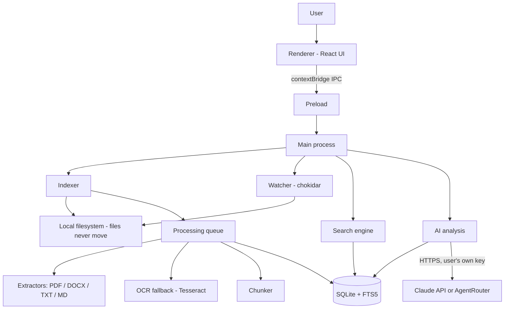

# Revelio Desktop — AI File Intelligence Platform

> Pivot plan: transform Revelio from an institutional document management system into a
> **desktop-first AI assistant for a user's local files**.
> Branch: `sohail-desktop`. The web app in `frontend/` stays untouched as the FS-05 answer.

---

## 1. Migration strategy from current Revelio

### What transfers (reuse)

| Asset | Location today | Desktop fate |
| --- | --- | --- |
| PDF text extraction + normalization | `frontend/src/lib/processing/extract.ts` | **Lift-and-shift** into main process |
| OCR fallback (Tesseract.js) | `frontend/src/lib/processing/ocr.ts` | **Lift-and-shift**, plus bundled `eng.traineddata` for offline OCR |
| Chunking | `frontend/src/lib/processing/chunk.ts` | **Lift-and-shift** |
| AI provider transport (Anthropic + AgentRouter) | `frontend/src/lib/processing/providers.ts` | **Lift-and-shift** — all endpoint/key/User-Agent quirks preserved |
| AI analysis contract (structured JSON, coercion, failure reasons) | `frontend/src/lib/processing/analyze.ts` | **Adapted**: institutional taxonomy (departments/categories enums) replaced with free-form category suggestion; same JSON-schema enforcement, same `AiOutcome` honesty contract |
| Search query parser | `frontend/src/lib/search/parse.ts` | **Adapted**: workflow filters (`status:`, `uploaded by`) replaced with file filters (`type:`, `in:`, `modified:`, `category:`) |
| Design system (warm paper tokens, dark theme) | `frontend/src/app/globals.css` | **Ported** to renderer |
| Test culture (`node --experimental-strip-types` suites) | `frontend/scripts/test-*.mts` | Same pattern for parser + query builder |

### What is adapted

| Asset | Change |
| --- | --- |
| Pipeline orchestration (`pipeline.ts`) | Supabase RPCs → local SQLite writes; same stage model (`extracting → analyzing → indexing → ready/failed`), same "never destroy user data on failure" contract |
| Search execution (`query.ts`) | PostgreSQL FTS → SQLite FTS5 with `bm25()` and the same fixed field weights |

### What is dropped

Supabase Auth, Storage, RLS, PostgreSQL, upload pipeline, workflow engine
(draft/submitted/reviews/approval), roles (student/faculty/HOD), comments,
reviews, audit logs, versioning of uploads, departments, seeded categories.

### Guiding principle (carried over from `architecture.md`)

**Non-custodial:** files never move. The app owns only derived data
(extracted text, metadata, index). Deleting the app deletes the index, never a file.
Recommendations are non-destructive; the app never writes to user files.

---

## 2. Folder structure

```text
Revelio/
├── frontend/                    # existing web app (untouched)
├── supabase/                    # existing web migrations (untouched)
├── docs/
└── desktop/                     # NEW — the desktop application
    ├── package.json
    ├── electron.vite.config.ts
    ├── tsconfig.json
    ├── resources/
    │   └── eng.traineddata      # copied from frontend/ for offline OCR
    ├── src/
    │   ├── shared/
    │   │   └── types.ts         # IPC contract — single source of truth
    │   ├── main/                # Electron main process (Node)
    │   │   ├── index.ts         # app lifecycle, window, menu
    │   │   ├── ipc.ts           # all IPC handlers
    │   │   ├── settings.ts      # settings store (userData/settings.json)
    │   │   ├── db/
    │   │   │   ├── schema.ts    # SQLite DDL + FTS5 + sync triggers
    │   │   │   └── db.ts        # connection + queries
    │   │   ├── processing/      # ported pipeline
    │   │   │   ├── extract.ts   # PDF (unpdf) + DOCX (mammoth) + TXT/MD
    │   │   │   ├── ocr.ts       # Tesseract, offline langdata
    │   │   │   ├── chunk.ts
    │   │   │   ├── providers.ts # Anthropic + AgentRouter transport
    │   │   │   └── analyze.ts   # free-form AI analysis
    │   │   ├── indexing/
    │   │   │   ├── walk.ts      # tolerant recursive walk
    │   │   │   ├── queue.ts     # bounded processing queue + progress
    │   │   │   ├── indexer.ts   # hash → extract → chunk → analyze → insert
    │   │   │   └── watcher.ts   # chokidar folder monitoring
    │   │   └── search/
    │   │       ├── parse.ts     # natural query → text + filters
    │   │       └── query.ts     # FTS5 builder, bm25 ranking, snippets
    │   ├── preload/
    │   │   └── index.ts         # contextBridge → window.api
    │   └── renderer/            # React app (Vite)
    │       ├── index.html
    │       └── src/
    │           ├── main.tsx
    │           ├── App.tsx      # shell: sidebar + routes (state-based)
    │           ├── styles.css   # ported paper design tokens + Tailwind v4
    │           ├── components/  # ui primitives, file-row, chips, palette
    │           └── pages/       # Dashboard, Search, DocumentDetail,
    │                            # Categories, Folders, Settings
    └── scripts/
        └── test-search.mts      # parser + query builder tests
```

**Why Electron (not Tauri):** every reusable asset is Node/JS — tesseract.js,
unpdf, @napi-rs/canvas, the Anthropic SDK, the AgentRouter fetch transport.
Tauri's Rust core would force a Node sidecar and double the work. Electron's
main process *is* the Node runtime the pipeline already runs in.

**Why Vite+React for the renderer (not Next.js):** the renderer is a UI over
local IPC — there is no server to render on, no routes to serve, no SEO.
Next.js would add a server runtime the app does not need. The investment in
the existing frontend is the **React components and design system**, and those
port directly.

---

## 3. Architecture diagram



Data flow for one file:

```text
folder connected / file detected
  → walk & filter (extension whitelist, size cap, exclusions)
  → SHA-256 hash (unchanged hash = skip, moved file = update locator)
  → extract text (PDF text layer → DOCX → plain text; OCR fallback for scans/images)
  → chunk
  → write files + chunks + FTS index (status: ready, searchable immediately)
  → AI analysis (summary, keywords, entities, dates, category) — optional, async,
    never blocks searchability, failure never destroys extracted text
```

---

## 4. SQLite schema

One database: `%APPDATA%/revelio-desktop/revelio.db` (WAL mode).

```sql
CREATE TABLE folders (
  id               INTEGER PRIMARY KEY AUTOINCREMENT,
  path             TEXT NOT NULL UNIQUE,      -- normalized absolute path
  label            TEXT,
  watch            INTEGER NOT NULL DEFAULT 1,
  ai_enabled       INTEGER NOT NULL DEFAULT 1,
  exclude_patterns TEXT NOT NULL DEFAULT '[]', -- JSON string[]
  last_indexed_at  TEXT,
  created_at       TEXT NOT NULL DEFAULT (strftime('%Y-%m-%dT%H:%M:%fZ','now'))
);

CREATE TABLE files (
  id              INTEGER PRIMARY KEY AUTOINCREMENT,
  folder_id       INTEGER REFERENCES folders(id) ON DELETE SET NULL,
  path            TEXT NOT NULL UNIQUE,       -- locator; updated on move
  filename        TEXT NOT NULL,
  extension       TEXT,
  kind            TEXT,                       -- pdf | docx | txt | md | image | other
  size            INTEGER,
  mtime           TEXT,                       -- ISO
  ctime           TEXT,
  content_hash    TEXT,                       -- SHA-256: source-independent identity
  status          TEXT NOT NULL DEFAULT 'pending', -- pending|processing|ready|failed|missing
  error           TEXT,
  method          TEXT,                       -- text | ocr | mixed
  page_count      INTEGER,
  char_count      INTEGER,
  title           TEXT,                       -- filename stem by default
  body            TEXT,                       -- capped extracted text (200k chars)
  summary         TEXT,
  keywords        TEXT,                       -- JSON string[]
  entities        TEXT,                       -- JSON {name,type}[]
  important_dates TEXT,                       -- JSON {label,date,is_deadline}[]
  category        TEXT,                       -- AI-suggested, free-form
  doc_date        TEXT,
  ai_model        TEXT,
  ai_status       TEXT NOT NULL DEFAULT 'none', -- none|pending|ok|skipped|failed
  ai_error        TEXT,
  indexed_at      TEXT,
  updated_at      TEXT
);

CREATE TABLE chunks (
  id          INTEGER PRIMARY KEY AUTOINCREMENT,
  file_id     INTEGER NOT NULL REFERENCES files(id) ON DELETE CASCADE,
  chunk_index INTEGER NOT NULL,
  page_start  INTEGER,
  page_end    INTEGER,
  content     TEXT NOT NULL
);

-- One FTS index with weighted columns; external-content over files.body.
CREATE VIRTUAL TABLE files_fts USING fts5(
  title, filename, keywords, body,
  content='files', content_rowid='id',
  tokenize='unicode61 remove_diacritics 2'
);
-- + AFTER INSERT/UPDATE/DELETE triggers on files keeping files_fts in sync.
```

Ranking (mirrors `architecture.md`): `bm25(files_fts, 10.0, 5.0, 4.0, 1.0)` —
**title > filename > keywords > body** — plus recency tie-break and an
exact-phrase bonus applied post-query.

---

## 5. Desktop integration plan

| Concern | Decision |
| --- | --- |
| Framework | Electron + electron-vite (main/preload/renderer in one toolchain) |
| DB | better-sqlite3 (ships Electron prebuilds; FTS5 built in) |
| Folder watch | chokidar, debounced, per connected root |
| File dialogs | `dialog.showOpenDialog` (directory selection) |
| Open/reveal | `shell.openPath`, `shell.showItemInFolder` |
| AI analysis | **Keyless since phase 2:** a built-in, deterministic, on-device engine (`desktop/src/main/processing/local/`, model marker `revelio-local`) produces summaries, keywords, categories, entities and dates. No API keys, no settings for them, no network calls — the earlier Anthropic/AgentRouter wiring was removed, and libraries skipped in the key era heal automatically on startup |
| OCR offline | `eng.traineddata` bundled in `resources/`, no CDN needed |
| Security | `contextIsolation: true`, `nodeIntegration: false`, preload-only bridge; renderer never touches fs/DB/keys directly |
| Packaging | electron-builder later (out of MVP scope; dev build for demo) |

### IPC contract (`src/shared/types.ts` is the single source of truth)

```text
folders:list / folders:add / folders:remove / folders:reindex / folders:setWatch
files:get / files:open / files:reveal / files:reanalyze / files:retry
search:query            (parsed query → ranked results + facets)
stats:get               (dashboard aggregates)
settings:get / settings:set
index:progress  (event) (queued/done/failed/current)
index:finished  (event)
```

---

## 6. Step-by-step implementation roadmap

| Step | Scope | Status |
| --- | --- | --- |
| 1 | Scaffold `desktop/` (electron-vite, TS, Tailwind v4, React 19) | this branch |
| 2 | SQLite schema + db module + settings store | this branch |
| 3 | Port processing pipeline (extract/ocr/chunk/providers) + DOCX/TXT/MD extractors | this branch |
| 4 | Adapt AI analysis to free-form categories | this branch |
| 5 | Indexer: walk → hash → extract → chunk → insert, bounded queue, progress events | this branch |
| 6 | Watcher: detect → process → index automatically | this branch |
| 7 | Search: parser (type:/in:/modified:/category:/"phrase") + FTS5 query builder + bm25 ranking | this branch |
| 8 | IPC bridge + preload | this branch |
| 9 | UI: Dashboard, Search, Document Details, Categories, Folders, Settings | this branch |
| 10 | Parser/query tests (same test pattern as web) | this branch |
| 11 | Polish: empty states, error states, keyboard nav | follow-up |
| 12 | Packaging (electron-builder installer) | follow-up |

## 7. MVP plan (demo-ready slice)

1. Connect 1–3 folders → full index with live progress.
2. Search that answers the pitch queries:
   - "machine learning notes from last semester" → keyword + `modified:` semantics
   - "resume where I mentioned Next.js" → body FTS
   - "invoice from Amazon in 2024" → text + `modified:2024`
   - `type:pdf`, `category:Finance`, `"exact phrase"`
3. Document details with AI insights (summary, keywords, entities, dates, category).
4. Categories screen grouping the library by AI-suggested categories.
5. Folder monitoring picks up new downloads automatically.
6. Works fully offline: search, OCR, indexing. AI enrichment is the only online feature and degrades gracefully (`ai_status: skipped/failed`, file still searchable).

## 8. Future scaling plan

| Feature | Extension point already reserved |
| --- | --- |
| Chat with files | `chunks` table is the retrieval source; ask Claude over top-N chunks with citations (file + page range) |
| Semantic search | add an `embeddings` table (file_id, chunk_id, blob) + a `method` discriminator; hybrid rank = bm25 + cosine |
| AI organization | suggest moves from category + folder co-occurrence; one-click approval via `shell` — never auto-move |
| More formats | extractor registry keyed by extension (xlsx, pptx, epub, html) |
| Drive/OneDrive/Dropbox | source-provider interface from `architecture.md`: index metadata in place, ACLs stay authoritative |
| Multi-machine sync | opt-in metadata-only sync keyed by content hash (web app is the future sync target) |
| Query understanding | AI rewrites natural query → filters; falls back to lexical parse offline |
